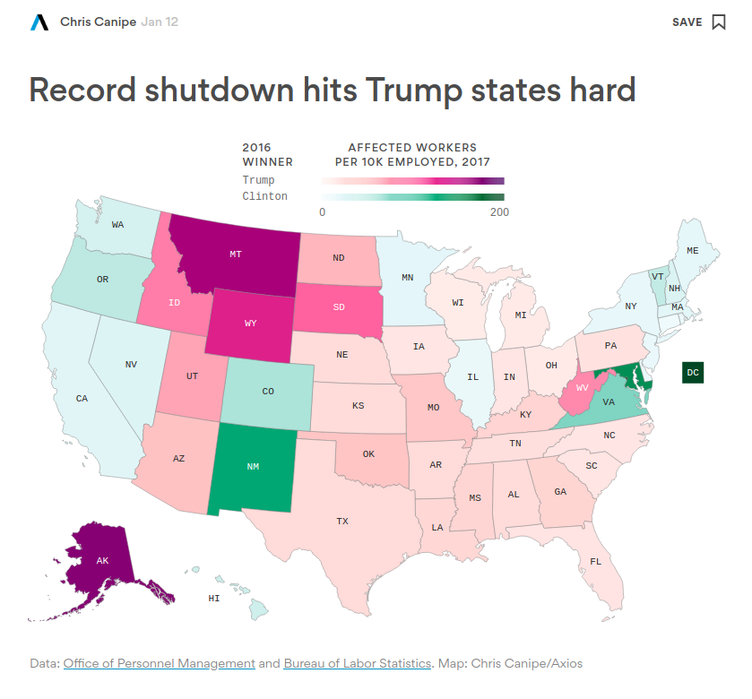

In January 2019, Axios produced a data visualization to demonstrate how the partial government shutdown was impacting different states and how that related to the outcomes of the 2016 presidential election. 

```{r, echo=FALSE}
print(getwd())

```
